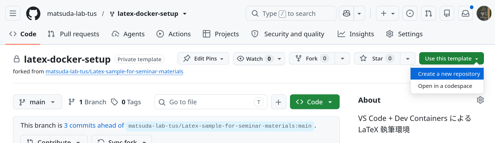

# VS Code + Dev Containers による LaTeX 執筆環境

本マニュアルは、コンテナ上に構築された LaTeX 環境を
VS Code から利用するための手順をまとめたものです。

本環境を用いることで、OSや個人環境に依存せず、
**同一の LaTeX 環境で論文・資料を執筆できます。**

## 1. この環境の特徴
- LaTeX 実行環境はすべて **コンテナ内**
- PCに TeX Live を入れる必要なし
- VS Codeから GUI 操作で起動・接続可能
- コンテナ起動時に **LaTeX Workshop 拡張も自動インストール**

つまり、
> 「フォルダを開いて、コンテナで開くだけ」

で 簡単に LaTeX 執筆環境が整います。

また、VS Code上でLaTeX文書を編集するため、AIツールを活用しやすくなります。

> [!IMPORTANT]
> 本リポジトリを利用することで、研究室サーバー上にも LaTeX 環境を構築できます。  
> ただし、サーバー負荷の分散のため、GPU を搭載していないサーバー(c26~c29, c31)を利用してください。

> [!TIP]
> 本リポジトリには以下が含まれます。
> - `.devcontainer/devcontainer.json`
> 
> これにより:
> - LaTeX 実行環境
> - VS Code 拡張（LaTeX Workshop 含む）
> - ビルド設定
>
> がすべて定義されます。  
> 基本的に**利用者が編集する必要はありません**

## 2. 初期設定
### 2.1 VS Code のセットアップ
#### 2.1.1 VS Code本体
Visual Studio Code (VS Code) をインストールする。  
https://code.visualstudio.com/

#### 2.1.2 VS Code 拡張機能
- Dev Containers (必須)
- Container Tools (任意)

> [!TIP]
> Container Tools は必須ではありませんが、  
> コンテナの状態確認やトラブル対応が分かりやすくなるためおすすめです

### 2.2 Docker Engine のインストール

#### Windows の場合（推奨：Docker Desktop）
[こちら](docker_win.md)
#### Mac の場合
https://docs.docker.com/desktop/setup/install/mac-install/

#### Linux の場合(研究室サーバー含む)
各ディストリビューションの公式手順に従って Docker Engine をインストールしてください。  
計算機サーバーにはインストール済みです。

#### 確認
```bash
docker version
docker compose version
```
両方表示されれば準備完了です。

### 2.3 Git のインストール
https://git-scm.com/instal
#### 確認
```bash
git --version
```
> [!NOTE]
> 計算機サーバーに環境構築する場合は、  
> すでにインストール済みのため省略可

### 2.4 GitHub CLI のインストール
https://cli.github.com/
#### 確認
```bash
gh --version
```
> [!NOTE]
> 計算機サーバーに環境構築する場合は、  
> すでにインストール済みのため省略可

### 2.5 GitHub Container Registry (GHCR)へのログイン
本環境で使用するコンテナイメージはプライベート公開のため、  
事前に GHCR へのログインが必要です。

GitHub CLI を用いてログインし、`read:packages` スコープを付与してください。

```bash
gh auth login
gh auth refresh -s read:packages
```

その後、Docker に認証情報を登録します。

```bash
gh auth token | docker login ghcr.io \
   --username "$(gh api user --jq .login)" \
   --password-stdin
```

> [!NOTE]
> 複数の GitHub アカウントを利用している場合は、  
> 研究室の Organization に所属しているアカウントでログインしていることを確認してください。

## 3. LaTeX 環境の起動手順
### 3.1 テンプレートからリポジトリを作成
1. GitHubの本リポジトリのページにアクセス  
https://github.com/matsuda-lab-tus/latex-docker-setup
1. 右上の `Use this template` から `Create a new repository` を選択

1. `Owner` として各自のアカウントを選択、適当な `Repository name` をつけて、`Create repository`
> [!WARNING]
> `Choose visibility` は `Private` を選択してください。  
> さもなければ、あなたの作成した文書が全世界に公開されます。

### 3.2 リポジトリのクローン
前節で作成したリポジトリを、適当なディレクトリにクローンしてください。
```bash
git clone <repository-url>
cd <repository-name>
```

### 3.3 VS Code でフォルダを開く
クローンしたディレクトリを VS Code で開きます。
```bash
code .
```
もしくは、
- VS Code を起動
- `File -> Open Folder…`
- クローンしたディレクトリを選択

でもOK。

### 3.4 Dev Container で開く
フォルダを開くと、右下に以下のような通知が表示されます。
> Reopen in Container

表示された場合はクリックしてください。

> [!NOTE]
> 通知が表示されない場合は、以下の手順を実行します。
> 1. `Ctrl + Shift + P`
> 2. `Dev Containers: Reopen in Container` を選択。

### 3.5 コンテナのプル・起動
Dev Container の起動時に、以下の処理が自動的に行われます。
- Docker イメージのプル・コンテナ起動
- VS Code Server の配置
- VS Code のコンテナへのアタッチ

### 3.6 起動完了の確認
起動が完了すると、VS Code 左下に以下が表示されます。
```
Dev Container: TeX Live
```
この表示が出ていれば、LaTeX 環境の準備は完了です。

以降の編集・ビルド操作はすべて\
**コンテナ内の LaTeX 環境**で実行されます。

## 4. LaTeX の利用方法
環境が起動したら、通常通り LaTeX ファイルを編集できます。

- LaTeX Workshop によるビルド
- PDF プレビュー
- `latexmk` コマンドによるビルド

すべてコンテナ内で実行されます。

LaTeX のビルドによって生成される PDF などの出力ファイルは、\
すべて `out/` ディレクトリに出力されます。

## 5. Container Tools（推奨）の確認
Container Tools をインストールしている場合、\
VS Code 左側に Containers アイコンが表示されます。

ここから、
- 起動中コンテナの確認
- Running / Stopped 状態の確認
- コンテナの再起動

などをGUIで行うことができます。

特に、以下の場合の確認に有効です。
- PC再起動後
- Docker Desktop 再起動後
- 「昨日まで動いていたが今日は動かない」  
などなど...

## 6. よくあるトラブルと対処
### 6.1 Windows：Docker Desktop が起動しない / WSL2 関連
- WSL2 が無効 or 未導入のことが多い
- Docker Desktop の指示に従い WSL を有効化
- BIOS で仮想化が無効だと動きません
### 6.2 VS Code：Reopen in Container が出ない
- 拡張機能 **Dev Containers** が入っているか確認
- VS Codeで開いているディレクトリが正しいか確認